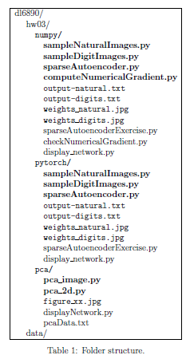
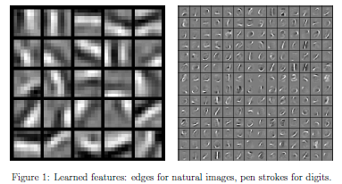

# Sparse Autoencoders and Principal Component Analysis to evaluate natural images and MNIST digits

## Description

In this project, I implement two versions of sparse Autoencoders using Numpy and Pytorch respectively to evaluate natural images and MNIST digits. I also implement Principal Component Analysis. Please view the **Implementation** section in the *autoencoder-pca.pdf* file for project details and the *Report.pdf* file for implementation results.

## Implementation 

Download the skeleton code from http://ace.cs.ohio.edu/~razvan/courses/dl6900/hw/hw03.zip.

Implement two versions of the sparse autoencoder in Python, using (1) NumPy and (2)

PyTorch in the corresponding folders, and evaluate them on natural images (-t natural)

and MNIST digits (-t digits). Implement also the PCA, PCA whitening, and ZCA whiten-

ing, following the steps explained in this section. Write code only in the files indicated

in bold. Make sure that you organize your code in folders as shown in Table 1 below.

For the sparse AE exercise, the visualization of the hidden units should be saved in the

jpg files listed in the table. For the PCA exercise, save each figure displayed by the code

into a jpg file **figure_xx.jpg**. The first part of the exercise should generate 6 figures

**figure_01.jpg** to **figure_06.jpg**, whereas the second part of the exercise should generate

5 figures **figure_07.jpg** to **figure_11.jpg**.

### 2.1 Sparse AE: NumPy Implementation

**1. Sampling images:** The training data for the autoencoder will be created from random

natural or digit images. For digit images, write code in the function *sampleDigitImages()*

that returns 20,000 random 28x28 images from the entire MNIST dataset (training

and testing). The images should be distinct. For natural images, write code in

*sampleNaturalImages()* that returns 10,000 random 8x8 patches from the set of 10

512x512 natural images stored in images.mat. These images have been whitened, so

the pixel values are not necessarily in \[0,1]. Consequently, the pixel values are further

normalized by calling *normalizeData()*.

**2. Cost & Gradient:** You will need to write code for the function *sparseAutoencoderCost()*

in **sparseAutoencoder.py** that computes the cost and the gradient. The cost and gra-

dient should be computed according to the formulas shown on slides 5-9 in [this Lecture](http://ace.cs.ohio.edu/~razvan/courses/dl6890/lecture02a.pdf).

Use the sigmoid as activation and output function.

**3. Vectorization:** It is very important to vectorize your code so that it runs quickly.

**4. Gradient checking:** Once you implemented the cost and the gradient in *sparseAutoencoderCost()*

verify that your gradient code is correct by running the **sparseAutoencoderExercise.py**

in *–debug* mode. This will use the **computeNumericalGradient.py** code that you wrote

for the first assignment. The norm of the difference between the numerical gradient

and your analytical gradient should be small, less than 10−9.

**5. Feature learning:** Training the autoencoder is done using L-BFGS for 400 epochs,

through the SciPy function [scipy.optimize.fmin_l_bfgs_b()]. If completely vectorized,

training the model on 20,000 random samples from the entire MNIST dataset should

take about 20 minutes on california. Training on the 10,000 random patches from

natural images should be much faster, due to the smaller number of samples and

parameters.

**6. Visualization:** To vizualize a learned feature, the code computes an input image that

would maximally activate the corresponding hidden neuron. This is done using the

formula in a previous theory question, as implemented in the *displayNetwork()* func-

tion. The learned features should be similar to the ones shown in Figure [1]: for natural

images they should resemble Gabor edges, whereas for digits they should resemble pen

strokes.

### 2.2 Sparse AE: PyTorch Implementation 

You will need to write code in **sparseAutoencoder.py**, in functions *get_vars()* and *cost()*:

1. *get_vars()* should create, initialize, and return variables for the data matrix X and

the parameters W1, b1 for the hidden layer, and W2, b2 for the output layer. The bias

weights should be initialized with 0, whereas for W1 and W2 use the [Glorot uniform initializer](http://pytorch.org/docs/master/_modules/torch/nn/init.html)

, also called Xavier uniform initializer. It draws samples from a uniform distribution within [−limit, limit] where limit is 

$$\sqrt{6/(fanin + fanout}$$ where fanin is the number of input units in the weight tensor and 

fanout is the number  of output units in the weight tensor.

\2. cost() should compute and return the cost of the sparse autoencoder on the input

data matrix X, by running forward propagation to compute the data cost and adding

the L2 regularization and KL-divergence sparsity terms.

The code for running gradient descent with minibatches is provided in sparseAutoen-

coderExercise.py. While you do not need to change this code, it is recommended that you

read it and understand how it works.

2.2.1 Bonus (25 points)

Change the code in sparseAutoencoderExercise.py to do batch training with L-BFGS for 400

iterations instead of SGD with Adam.

2.3 PCA and Whitening in 2D (50 points)

Coding effort: my implementation has 9 lines of code.

In this exercise you will implement PCA, PCA whitening and ZCA whitening, as de-

scribed in the Lecture 3. The only file you need to modify is pca 2d.py. Implementing this

exercise will make the next exercise significantly easier to understand and complete.

Step 0: Load data: The starter code contains code to load 45 2D data points. When

plotted using the scatter function, the results should look like in Figure [2(a)](#br5).

Step 1: Implement PCA: In this step, you will implement PCA to obtain xRot, the

matrix in which the data is ”rotated” to the basis made up of the principal components.

You should make use of NumPy’s svd() function here.

Step 1a: Finding the PCA basis: Find u and u , and draw two lines in your figure

1

2

to show the resulting basis on top of the given data points. Your figure should look like in

Figure [2(b).](#br5)

Step 1b: Check xRot: Compute xRot, and use the NumPy scatter() function to check

that xRot looks as it should, which should be something like in Figure [3(a).](#br5)

Step 2: Dimensionality reduction: In the next step, set k, the number of components

to retain, to be 1. Compute the resulting xHat and plot the results, as in Figure [3(b).](#br5)

Step 3: PCA Whitening: Implement PCA whitening using the formula from Lecture 3.

Plot xPCAWhite, and verify that it looks like in Figure [4(a).](#br6)

Figure 2: (a) Raw data; (b) Raw data and PCA basis.

Figure 3: (a) Data rotated through PCA; (b) One-dimensional projection.

Step 4: ZCA Whitening: Implement ZCA whitening and plot the results. The results

should look like in Figure [4(b](#br6)).

2.4 PCA and Whitening on natural images (50 points)

Coding effort: my implementation has 19 lines of code.

In this exercise, you will implement PCA, PCA whitening and ZCA whitening, and ap-

ply them to image patches taken from natural images. The only file you need to modify is

pca image.py.

Step 0a: Load data: The starter code contains code to load a set of natural images and

sample 12x12 patches from them. The raw patches will look something like in Figure [5(a).](#br7)

These patches are stored as column vectors in the 144 x 10,000 array x.

Step 0b: Zero mean the data: First, for each image patch, compute the mean pixel value

and subtract it from that image, this centering the image around zero. You should compute

a different mean value for each image patch.

Figure 4: (a) PCA Whitening; (b) ZCA Whitening.

Step 1a: Implement PCA: In this step, you will implement PCA to obtain xRot, the

matrix in which the data is ”rotated” to the basis comprising the principal components.

Note that in this part of the exercise, you should not whiten the data.

Step 1b: Check covariance: To verify that your implementation of PCA is correct, you

should check the covariance matrix for the rotated data xrot. PCA guarantees that the

covariance matrix for the rotated data is a diagonal matrix (a matrix with non-zero entries

only along the main diagonal). Implement code to compute the covariance matrix and verify

this property. One way to do this is to compute the covariance matrix, and visualise it using

the SciPy function misc.imsave(). The image should show a white diagonal line against a

dark background. For this dataset, because of the range of the diagonal entries, the diagonal

line may not be apparent, but this trick of visualizing using imsave() will come in handy

later in this exercise.

Step 2: Find number of components to retain: Next, choose k, the number of prin-

cipal components to retain. Pick k to be as small as possible, but so that at least 99% of

the variance is retained. In the step after this, you will discard all but the top k principal

components, reducing the dimension of the original data to k. Write down the value of k in

your report.

Step 3: PCA with dimensionality reduction: Now that you have found k, compute x˜,

the reduced-dimension representation of the data. This gives you a representation of each

image patch as a k dimensional vector instead of a 144 dimensional vector. If you are training

a sparse autoencoder or other algorithm on this reduced-dimensional data, it will run faster

than if you were training on the original 144 dimensional data.

To see the effect of dimensionality reduction, go back from x˜ to produce the matrix

xˆ, the dimension-reduced data but expressed in the original 144 dimensional space of image

patches. Visualise xˆ and compare it to the raw data, x, as shown in Figure [5.](#br7)You will observe

that there is little loss due to throwing away the principal components that correspond to

dimensions with low variation. For comparison, you may also wish to generate and visualise

xˆ for when only 90% of the variance is retained.

Step 4a: Implement PCA with whitening and regularization: Now implement PCA

Figure 5: (a) Raw patches; (b) PCA projected images, 99% variance.

with whitening and regularization to produce the matrix xPCAWhite. Use epsilon = 0.1.

Step 4b: Check covariance: Similar to using PCA alone, PCA with whitening also

results in processed data that has a diagonal covariance matrix. However, unlike PCA

alone, whitening additionally ensures that the diagonal entries are equal to 1, i.e. that the

covariance matrix is the identity matrix.

That would be the case if you were doing whitening alone with no regularization. How-

ever, in this case you are whitening with regularization, to avoid numerical problems as-

sociated with small eigenvalues. As a result of this, some of the diagonal entries of the

covariance of your xPCAwhite will be smaller than 1. To verify that your implementation of

PCA whitening with and without regularization is correct, you can check these properties.

Implement code to compute the covariance matrix and verify this property. As earlier, you

can visualise the covariance matrix with the SciPy function misc.imsave().

Step 5: ZCA whitening: Now implement ZCA whitening to produce the matrix xZ-

CAWhite. Visualize xZCAWhite and compare it to the raw data, x, as shown in Figure [6.](#br8)

You should observe that whitening results in, among other things, enhanced edges. Try

repeating this with epsilon set to 1, 0.1, and 0.01, and see what you obtain. The example in

Figure [6](#br8)was obtained with epsilon = 0.1.

3 Submission

Turn in a hard copy of your homework report at the beginning of class on the due date.

Electronically submit on Blackboard a hw03.zip file that contains the hw03 folder in which

you change code only in the required files. The screen output produced when running the

sparseAutoencoderExercise.py code should be redirected to (saved into) the corresponding

output-.txt files.

On a Linux system, creating the archive can be done using the command:

\> zip -r hw03.zip hw03.

Figure 6: (a) Raw patches; (b) ZCA whitened images.
