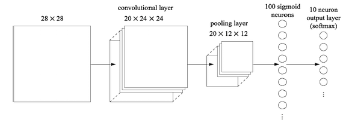

# Convolutional neural networks for digit classification using PyTorch

## Decription
In this project, I implement the ConvNet for digit classification using PyTorch. Implementation details are given below and can also be found in the *Implementation* section in the **Convolutional-nn.pdf** file. Please view the **Report.docx** file for implementation results.

## 1. Theory
   1. [**CNN Complexity**] Consider the final convolutional network from step 7 in the implementation part below. What is the total number of parameters? Show your work, i.e. a breakdown of the total number of parameters, layer by layer. Describe at least three different ways of reducing the number of parameters in this network, and discuss their relative advantages/disadvantages.

## 2. Implementation 

Download the skeleton code from http://ace.cs.ohio.edu/~razvan/courses/dl6890/hw/hw04.zip. Implement the ConvNet for digit classication, as explained in the 7 steps below, using PyTorch. Make sure that you organize your code in folders as shown in the table below. P.S.- MNIST data used in this project is not provided in this directory, so please obtain it separately if needed.

<pre>
dl6890/
  hw04/
    pytorch/
      <b>train_cnn.py</b> 
      cnnExercise.py 
      expand_mnist.py 
      <b>output.txt</b>
    data/
      mnist/
</pre>

Write code only in **train cnn.py**. The traces from running **python3 cnnExercise.py** \<mode\> for each of the 7 steps below should be saved in output.txt. In each step you will train the corresponding architecture and report the accuracy on the test data. Hyper- parameters are kept unchanged from one step to the next, unless changes are explicitly mentioned. By default, the code is written to run on the CPU, with the expected accuracy numbers shown in cnnExercise.py. If your PyTorch installation and architecture supports GPUs, you can set `self.use_gpu = False` inside **train_cnn.py** which can make the code run twice as fast. It is recommended that you read and understand the code in **cnnExercise.py** and **expand mnist.py**.

Most of the functionality needed for completing this assignment is implemented in the package [torch.nn.](http://pytorch.org/docs/0.1.12/nn.html). One approach is to create a Sequential model, to which you add modules in order using the *add_module()* method. All types of layers and processing you need are already implemented in *torch.nn*, by subclassing from *torch.nn.Module*. Alternative, but very similar approaches for coding CNNs can also be seen in the PyTorch tutorials, e.g. the [Training an Image Classier](http://pytorch.org/tutorials/beginner/blitz/cifar10_tutorial.html#training-an-image-classifier) tutorial. Relevant classes and functions: *nn.Sequential, nn.Linear, nn.Sigmoid, nn.ReLU, nn.LogSoftmax, nn.Conv2D, nn.MaxPool2d, nn.Dropout*.

The output of a convolutional layer for one example is a 3D tensor. To be used as input for a fully connected layer, it needs to be transformed into a 1D tensor. For your convenience, a generic shape transformation is implemented as a PyTorch module in the ViewOP class. You will need to use this between the last convolutional layer and the first fully connected layer.

**Step 1: Baseline with one hidden layer:** Create a shallow architecture using a single hidden layer, fully connected, containing 100 neurons, with sigmoid activation function. Train for 30 epochs, using SGD with a learning rate of 0.1, a mini-batch size of 10, and no regularization.

**Step 2: One convolutional + one hidden layer:** Insert a convolutional layer at the beginning of the network, followed by a max-pooling layer and the fully connected layer from step 1. Use 5x5 local receptive fields, a stride of 1, and 20 kernels. The max-pooling layer should combine features using 2x2 pooling windows. The overall architecture should look as in the figure below.

**Step 3: Two convolutional + one hidden layer:** Insert a second convolutional-pooling layer between the existing convolutional-pooling layer and the fully-connected hidden layer. Use a 5x5 local receptive field for 40 kernels and pool over 2x2 regions.

**Step 4: Two convolutional + one hidden layer, ReLU:** Replace **sigmoid** with **ReLU** as activation function in the entire network from step 3. Train the model using a new learning rate of 0.03.

**Step 5: Two convolutional + one hidden layer, ReLU, data augmentation:** Augment the training data by displacing each training image by a single pixel: up one pixel, down one pixel, left one pixel, or right one pixel. Do this by running the program `expand_mnist.py` in the `mnist/data/` folder. Retrain the model from step 4 on the augmented dataset.

**Step 6: Two convolutional + two hidden layers, ReLU, data augmentation:** Add a second fully-connected layer with 100 neurons to the model from step 5.

**Step 7: Two convolutional + two large hidden layers, ReLU, data augmentation, Dropout:** Increase the number of neurons on the fully connected layers to 200. Do regularization by applying [Dropout](https://arxiv.org/pdf/1207.0580.pdf) on the activations of the two fully-connected layers, using a dropout rate of 0.5.

## 3.1 Bonus

In train cnn.py, we have manually split the dataset into minibatches. Write code to do this using the [torch.utils.data.DataLoader](http://pytorch.org/docs/master/data.html) class. You may find this [Data Loading and Processing Tutorial](http://pytorch.org/tutorials/beginner/data_loading_tutorial.html#sphx-glr-beginner-data-loading-tutorial-py) useful.

## 3.2 Bonus

Implement all the above using NumPy. This requires updating backpropagation to go through convolutional and pooling layers. How to do this is explained in the [UFLDL Tutorial](http://ufldl.stanford.edu/wiki/index.php/Exercise:Convolution_and_Pooling). Alternatively, you can implement only forward propagation and the cost in NumPy and use autograd for the gradient computation.

## Obtain Results

The screen output produced when running the **cnnExercise.py** code should be redirected to (saved into) the output.txt file.
